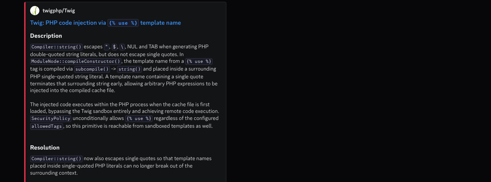
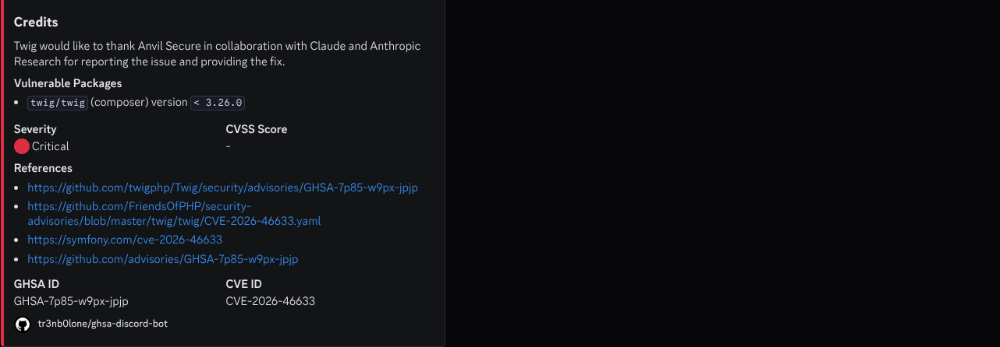

## What is it?
A sane way to get notified of the newest vulnerabilities as witnessed from the Github Security Advisories DB.
* Notifications are delivered via a discord webhook. read [this](https://support.discord.com/hc/en-us/articles/228383668-Intro-to-Webhooks) for further guidance.

## Getting Started:
- Fork the repo.
- Prepare a discord channel with a webhook integration.
- Place `DISCORD_WEBHOOK_URL` as the fork's secret.
- After enabling Github actions, you will get notifed every 18 hours. Why 18? No particluar reason. change if needed.

## Screenshots:
A typical output looks something like:



### development environment
If you have Nix installed (with flakes enabled):
```bash
nix develop
# but if you have direnv enabled, you can simply run `direnv allow ` on the repo.
```
This sets up everything you need for local development.
